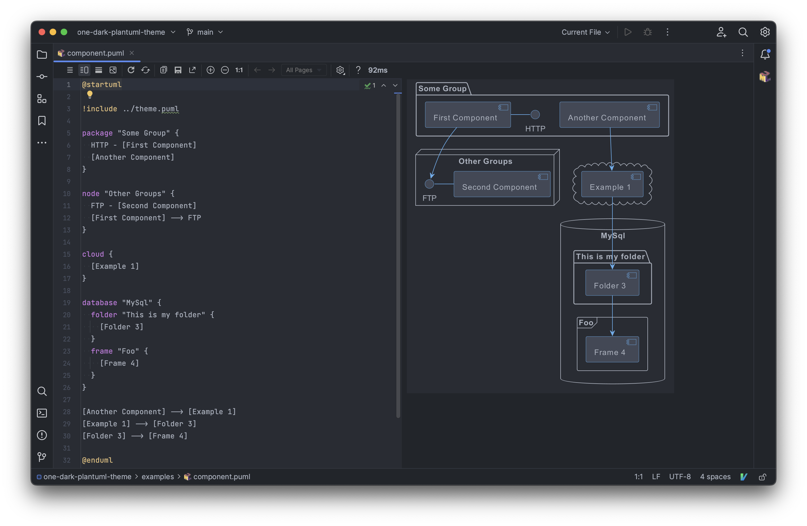
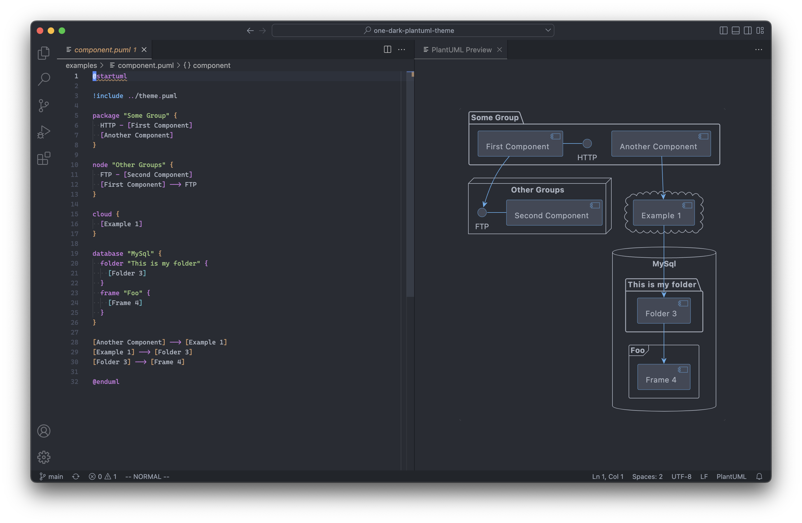
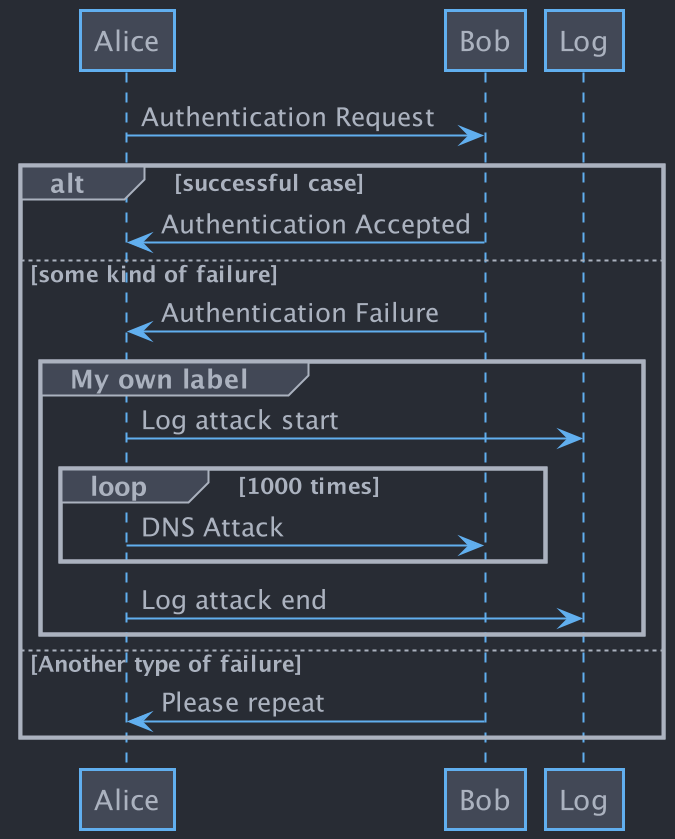
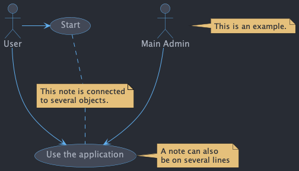
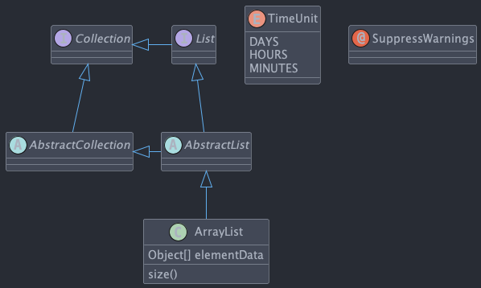
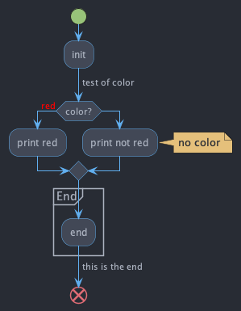
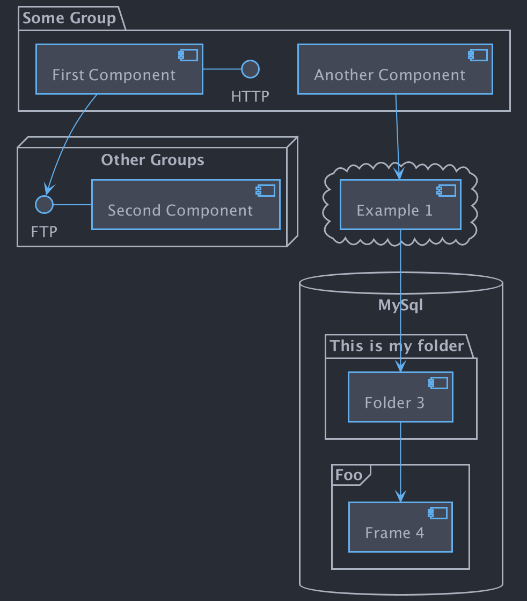
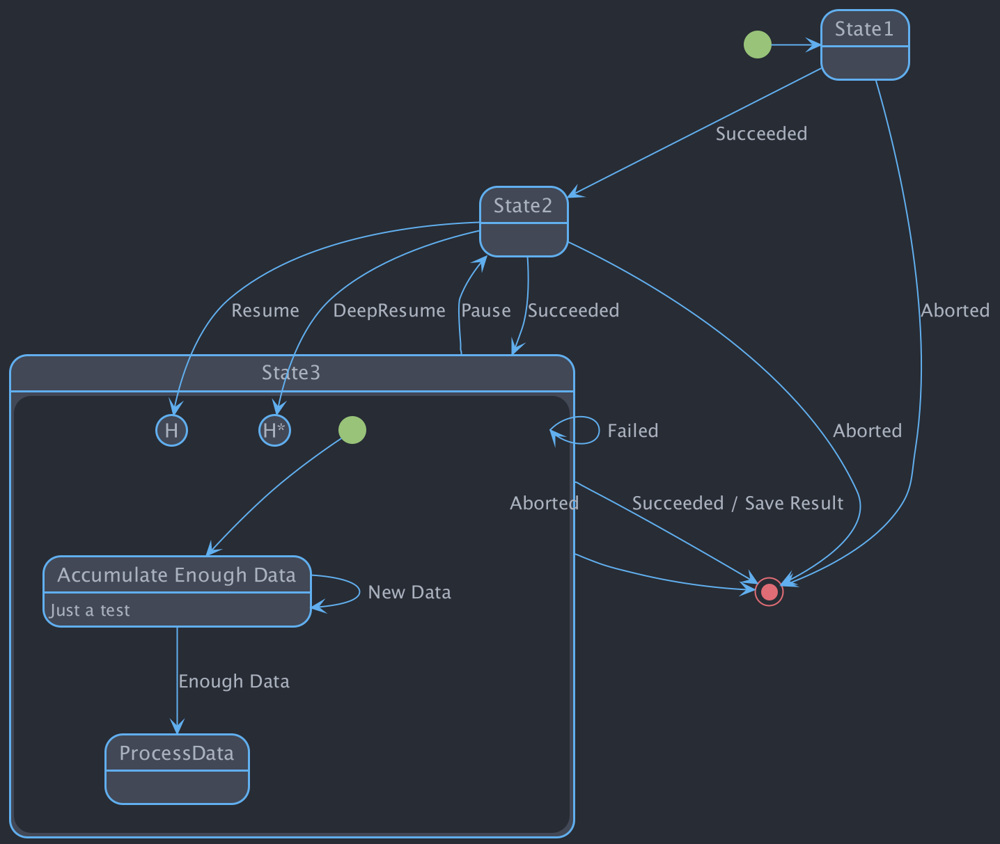

# [One Dark](https://github.com/atom/atom/tree/v1.53.0/packages/one-dark-ui) [PlantUML](https://plantuml.com) theme

## Screenshots

JetBrains:



Visual Studio Code:



## Usage

[`!include`](https://plantuml.com/preprocessing#393335a6fd28a804) the theme file:

```puml
@startuml

!include https://raw.githubusercontent.com/ptrkcsk/one-dark-plantuml-theme/v1.0.1/theme.puml

Bob->Alice : hello

@enduml
```

## Examples

Sequence diagram:



Use case diagram:



Class diagram:



Activity diagram:



Component diagram:



State diagram:


