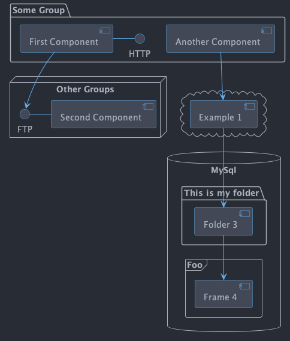
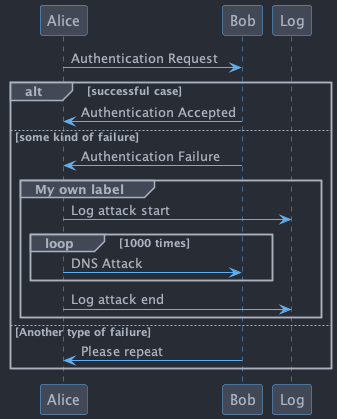

# [One Dark](https://github.com/atom/atom/tree/v1.53.0/packages/one-dark-ui) [PlantUML](https://plantuml.com) theme

## Screenshots

| JetBrains | Visual Studio Code |
|:---:|:---:|
|  |  |

## Usage

[`!include`](https://plantuml.com/preprocessing#393335a6fd28a804) the theme file:

```puml
@startuml

!include https://raw.githubusercontent.com/ptrkcsk/one-dark-plantuml-theme/v1.0.0/theme.puml

Bob->Alice : hello

@enduml
```

## Examples

| Activity | Class | Component |
|:---:|:---:|:---:|
|  |  |  |

| Sequence | State | Use case |
|:---:|:---:|:---:|
|  |  |  |
