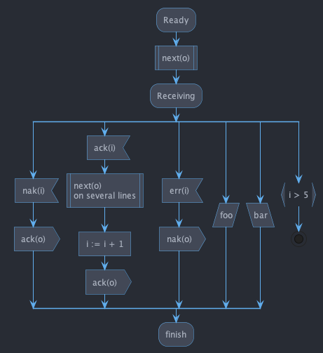
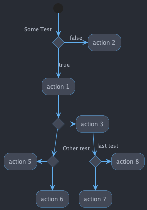
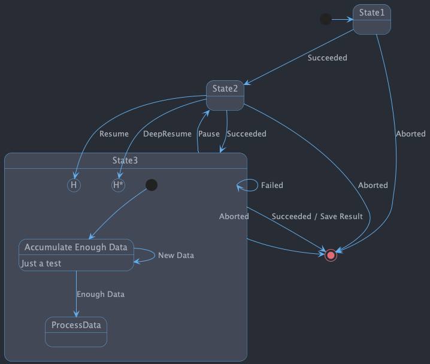

# One Dark PlantUML theme

## Usage

[`!include`](https://plantuml.com/preprocessing#393335a6fd28a804) the theme file:

```puml
@startuml

!include https://raw.githubusercontent.com/ptrkcsk/one-dark-plantuml-theme/v1.0.0/theme.puml

Bob->Alice : hello

@enduml
```

## Examples

||||
|---|---|---|
|  |  |  |
|   |  |  |
|  |||
